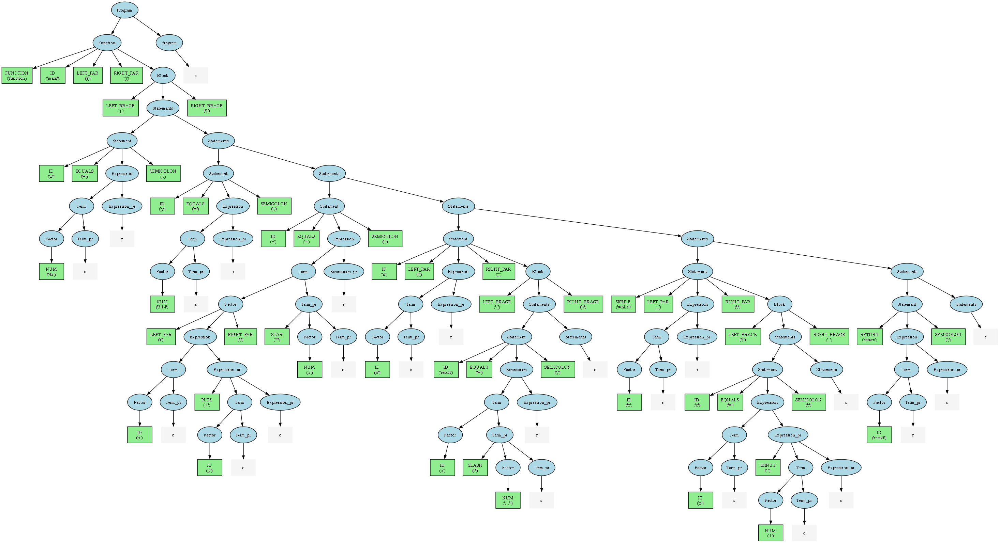
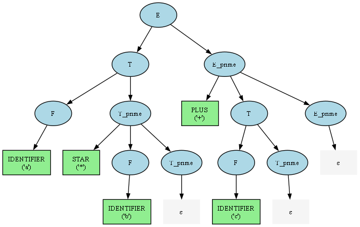

# TLA-CE4032
---
## EXEE-GROUP
---
# Theory of Languages and Machines - Mini Compiler Project

**Authors:** [Mohammad Mahdi Sharifbeigy](https://github.com/MohammadMahdi-Sharifbeigy), Mani Zamani

## Overview

This project implements a complete mini-compiler that demonstrates the practical application of formal language theory concepts. The compiler processes LL(1) grammars, performs lexical and syntax analysis using a Deterministic Pushdown Automaton (DPDA), generates parse trees, and provides symbol renaming functionality.

## Features

- **LL(1) Grammar Processing**: Loads and validates LL(1) grammars from file
- **Lexical Analysis**: Tokenizes input text based on grammar terminal patterns
- **Syntax Analysis**: Uses DPDA for deterministic parsing with detailed step logging
- **Parse Tree Generation**: Constructs and visualizes parse trees from DPDA logs
- **Parse Table Visualization**: Exports LL(1) parse tables in HTML and PDF formats
- **Symbol Renaming**: Interactive renaming of identifiers with scope awareness
- **Comprehensive Visualization**: Generates parse trees and derivation step diagrams

## Project Structure

```
Mini-Compiler/
├── main.py                 # Main application entry point
├── lexical_analyzer.py     # Lexical analysis and tokenization
├── parse_table.py          # LL(1) parse table generation and management
├── dpda.py                 # Deterministic Pushdown Automaton implementation
├── parse_tree.py           # Parse tree generation and visualization
├── Symbol_renamer.py       # Symbol renaming functionality
├── Grammers/              # Grammar files directory
│   ├── grammar.ll1        # Simple expression grammar
│   ├── grammar2.ll1       # Function-based programming language grammar
│   └── grammar2.txt       # Sample input for grammar2
└── Output/                # Generated visualizations and exports
    ├── Parse_Tables/      # Parse table exports
    ├── Parse_Tree_From_DPDA_Log/  # Parse tree visualizations
    └── DPDA_Derivations/  # DPDA step visualizations
```

## Installation and Setup

### Prerequisites

- Python 3.7 or higher
- Graphviz (for visualization generation)

### Required Python Packages

```bash
pip install graphviz
```

### Graphviz Installation

**Windows:**
- Download from: https://graphviz.org/download/
- Add to system PATH

**macOS:**
```bash
brew install graphviz
```

**Linux (Ubuntu/Debian):**
```bash
sudo apt-get install graphviz
```

## Usage

### Basic Usage

```bash
python main.py <grammar_file> [input_file]
```

**Parameters:**
- `grammar_file`: Path to the LL(1) grammar file (without "Grammers/" prefix)
- `input_file`: Optional path to input code file (interactive mode if not provided)

### Examples

**Example 1: Expression Grammar**
```bash
python main.py grammar.ll1
```

**Example 2: Function Grammar with Input File**
```bash
python main.py grammar2.ll1 grammar2.txt
```

## Grammar Specifications

### Grammar 1: Mathematical Expressions

**File:** `Grammers/grammar.ll1`

```
START = E

NON_TERMINALS = E, E_prime, T, T_prime, F
TERMINALS = IDENTIFIER, LITERAL, PLUS, STAR, LEFT_PAR, RIGHT_PAR

Productions:
E -> T E_prime
E_prime -> PLUS T E_prime | eps
T -> F T_prime
T_prime -> STAR F T_prime | eps
F -> LEFT_PAR E RIGHT_PAR | IDENTIFIER | LITERAL

Terminal Patterns:
IDENTIFIER -> [a-zA-Z_][a-zA-Z0-9_]*
LITERAL -> \d+(\.\d+)?
PLUS -> \+
STAR -> \*
LEFT_PAR -> \(
RIGHT_PAR -> \)
```

**Sample Valid Inputs:**
- `(a + b) * (c + d)`
- `(123)`
- `a * b * c + d`
- `x + y`
- `42 * (a + 3.14)`

### Grammar 2: Simple Programming Language

**File:** `Grammers/grammar2.ll1`

```
START = Program

NON_TERMINALS = Program, Function, Block, Statements, Statement, Expression, Expression_pr, Term, Term_pr, Factor
TERMINALS = FUNCTION, ID, NUM, IF, WHILE, RETURN, LEFT_PAR, RIGHT_PAR, LEFT_BRACE, RIGHT_BRACE, EQUALS, SEMICOLON, PLUS, MINUS, STAR, SLASH

Productions:
Program -> Function Program | eps
Function -> FUNCTION ID LEFT_PAR RIGHT_PAR Block
Block -> LEFT_BRACE Statements RIGHT_BRACE
Statements -> Statement Statements | eps
Statement -> ID EQUALS Expression SEMICOLON | IF LEFT_PAR Expression RIGHT_PAR Block | WHILE LEFT_PAR Expression RIGHT_PAR Block | RETURN Expression SEMICOLON
Expression -> Term Expression_pr
Expression_pr -> PLUS Term Expression_pr | MINUS Term Expression_pr | eps
Term -> Factor Term_pr
Term_pr -> STAR Factor Term_pr | SLASH Factor Term_pr | eps
Factor -> ID | NUM | LEFT_PAR Expression RIGHT_PAR

Terminal Patterns:
FUNCTION -> function
IF -> if
WHILE -> while
RETURN -> return
ID -> [a-zA-Z_][a-zA-Z0-9_]*
NUM -> -?\d+(\.\d+)?([eE][+-]?\d+)?
LEFT_PAR -> \(
RIGHT_PAR -> \)
LEFT_BRACE -> \{
RIGHT_BRACE -> \}
EQUALS -> =
SEMICOLON -> ;
PLUS -> \+
MINUS -> -
STAR -> \*
SLASH -> /
```

**Sample Valid Input:**
```c
function main ( ) {
    x = 42 ;
    y = 3.14 ;
    z = ( x + y ) * 2 ;

    if ( z ) {
        result = z / 1.5 ;
    }

    while ( x ) {
        x = x - 1 ;
    }
    return result ;
}
```


## Example Output Explanation

### 1. Grammar Information Display

The system first displays comprehensive grammar information:

```
=== Grammar Information ===
Start Symbol: Program
Non-Terminals: Program, Function, Block, Statements, Statement, Expression, Expression_pr, Term, Term_pr, Factor
Terminals: FUNCTION, ID, NUM, IF, WHILE, RETURN, LEFT_PAR, RIGHT_PAR, LEFT_BRACE, RIGHT_BRACE, EQUALS, SEMICOLON, PLUS, MINUS, STAR, SLASH
Productions:
  Program -> Function Program | eps
  Function -> FUNCTION ID LEFT_PAR RIGHT_PAR Block
  [... additional productions ...]
Token Patterns:
  TokenType.FUNCTION -> function
  TokenType.ID -> [a-zA-Z_][a-zA-Z0-9_]*
  [... additional patterns ...]
```

### 2. LL(1) Parse Table

The system generates and displays the complete LL(1) parse table showing which production rule to apply for each (non-terminal, terminal) combination:

```
+---------------+--------+--------+------------------------------------------+
| Non-Terminal  | $      | EQUALS | FUNCTION                                 |
+---------------+--------+--------+------------------------------------------+
| Block         |        |        |                                          |
| Expression    |        |        |                                          |
| Function      |        |        | FUNCTION ID LEFT_PAR RIGHT_PAR Block    |
| Program       | eps    |        | Function Program                         |
+---------------+--------+--------+------------------------------------------+
```

### 3. Lexical Analysis Output

For the input `function main ( ) { x = 42 ; ... }`, the lexer produces:

```
1. Lexical Analysis:
   Tokens generated:
     0: Token(TokenType.FUNCTION, 'function', 0)
     1: Token(TokenType.ID, 'main', 10)
     2: Token(TokenType.LEFT_PAR, '(', 15)
     3: Token(TokenType.RIGHT_PAR, ')', 17)
     4: Token(TokenType.LEFT_BRACE, '{', 19)
     5: Token(TokenType.ID, 'x', 25)
     6: Token(TokenType.EQUALS, '=', 27)
     7: Token(TokenType.NUM, '42', 29)
     8: Token(TokenType.SEMICOLON, ';', 32)
     [... additional tokens ...]
```

### 4. DPDA Processing Steps

The DPDA shows detailed step-by-step parsing with stack operations:

```
Step  Stack (Top Left)                         Input Remainder                Action
--------------------------------------------------------------------------------------------------------------------------------
1     Program $                                function main ( ) { x = 42 ; y Expand: Program -> Function Program
2     Function Program $                       function main ( ) { x = 42 ; y Expand: Function -> FUNCTION ID LEFT_PAR RIGHT_PAR Block
3     FUNCTION ID LEFT_PAR RIGHT_PAR Block Pro function main ( ) { x = 42 ; y Match terminal: 'FUNCTION'
4     ID LEFT_PAR RIGHT_PAR Block Program $    main ( ) { x = 42 ; y = 3.14 ; Match terminal: 'ID'
[... continues for all 134 steps ...]
134   $                                        $                              Accept: Stack and Input both at EOF.
```

### 5. Parse Tree Structure

The system generates a hierarchical parse tree:

```
E
  |-- T
    |-- F
      |-- IDENTIFIER: 'a' @ pos 0
    |-- T_prime
      |-- STAR: '*' @ pos 2
      |-- F
        |-- IDENTIFIER: 'b' @ pos 4
      |-- T_prime
        |-- eps: 'ε'
  |-- E_prime
    |-- PLUS: '+' @ pos 6
    |-- T
      |-- F
        |-- IDENTIFIER: 'c' @ pos 8
      |-- T_prime
        |-- eps: 'ε'
    |-- E_prime
      |-- eps: 'ε'
```


*Parse tree for the expression "a * b + c" showing operator precedence*


### 6. Symbol Renaming Process

The symbol renaming feature identifies all identifiers and allows interactive renaming:

```
=== Symbol Renaming ===
Found identifier: main at node ParseTreeNode(ID, val='main', term=True)
Found identifier: x at node ParseTreeNode(ID, val='x', term=True)
Found identifier: y at node ParseTreeNode(ID, val='y', term=True)
Found identifier: z at node ParseTreeNode(ID, val='z', term=True)
Found identifier: result at node ParseTreeNode(ID, val='result', term=True)

Available identifiers:
  'main' (appears 1 time(s) at position(s): [0])
  'x' (appears 5 time(s) at position(s): [1, 4, 9, 10, 11])
  'y' (appears 2 time(s) at position(s): [2, 5])
  'z' (appears 3 time(s) at position(s): [3, 6, 8])
  'result' (appears 2 time(s) at position(s): [7, 12])

Enter identifier value to rename (or 'q' to cancel): main
Found 1 occurrence(s) of 'main'
Enter new name (or press Enter to cancel): master

✓ Renaming successful!
Modified code: function master ( ) { x = 42 ; y = 3.14 ; z = ( x + y ) * 2 ; if ( z ) { result = z / 1.5 ; } while ( x ) { x = x - 1 ; } return result ; }
```

## Generated Visualizations

The system generates several types of visualizations saved to different directories:

### 1. Parse Table Exports
**Location**: `Parse_Tables/`
- **HTML Format**: `parse_table.html` - Interactive table with color coding and hover effects
- **PDF Format**: `parse_table_viz.pdf` - Professional-quality table for documentation and printing

### 2. Parse Tree Diagrams
**Location**: `Parse_Tree_From_DPDA_Log/`
- **PNG Format**: `parse_tree_<input_name>.png` - High-resolution image for presentations and documents
- **PDF Format**: `parse_tree_<input_name>.pdf` - Vector format for scalable printing
- **Color-coded nodes**: 
  - Non-terminals (light blue ovals)
  - Terminals (light green rectangles with values)
  - Epsilon nodes (gray plaintext)


### 3. Derivation Steps
**Location**: `Parse_Tree_From_DPDA_Log/Derivations/`
- **PDF Format**: `derivation_<input_name>.pdf` - Sequential step-by-step derivation process
- **Production rules**: Shows which grammar rules are applied at each step
- **Left-to-right layout**: Each step connected by arrows showing derivation progression

### 4. DPDA Processing Steps  
**Location**: `DPDA_Derivations/`
- **PDF Format**: `dpda_derivation_<input_name>.pdf` - Visual representation of DPDA execution
- **Step-by-step**: Shows stack contents, input remainder, and actions taken
- **Color coding**: Accept states (green), error states (red), normal steps (yellow)

## Working with Generated Files

### File Naming Convention
All generated files use sanitized input names:
- Special characters replaced: `*` → `star`, `+` → `plus`, `(` → `lpar`, `)` → `rpar`
- Spaces replaced with underscores
- Truncated to 30 characters for filesystem compatibility

### Typical Output Files for Input "a * b + c":
```
Parse_Tables/
├── parse_table.html
└── parse_table_viz.pdf

Parse_Tree_From_DPDA_Log/
├── parse_tree_a_star_b_plus_c.png 
├── parse_tree_a_star_b_plus_c.pdf
└── Derivations/
    └── derivation_a_star_b_plus_c.pdf

DPDA_Derivations/
└── dpda_derivation_a_star_b_plus_c.pdf
```

## Implementation Details

### Key Algorithms

1. **FIRST and FOLLOW Sets**: Computed for LL(1) parse table construction
2. **LL(1) Conflict Detection**: Validates grammar properties
3. **DPDA Simulation**: Stack-based parsing with deterministic transitions
4. **Parse Tree Construction**: Bottom-up tree building from DPDA logs
5. **Symbol Table Management**: Identifier tracking for renaming operations

### Architecture

- **Modular Design**: Separate classes for each compiler phase
- **Error Handling**: Comprehensive error detection and reporting
- **Visualization Integration**: Seamless graphviz integration for diagrams
- **Interactive Features**: User-friendly command-line interface

## Theoretical Background

This project demonstrates several key concepts from formal language theory:

- **Context-Free Grammars (CFG)**: Both grammars are context-free
- **LL(1) Parsing**: Top-down, left-to-right parsing with 1 lookahead token
- **Deterministic Pushdown Automata**: Stack-based parsing machines
- **Parse Trees**: Concrete syntax trees showing derivation structure
- **First and Follow Sets**: Essential for LL(1) table construction

## Troubleshooting

### Common Issues

1. **Graphviz Not Found**: Ensure Graphviz is installed and in system PATH
2. **Grammar Conflicts**: Verify grammar is truly LL(1) - no conflicts in parse table
3. **Token Recognition**: Check regex patterns in grammar file match intended tokens
4. **File Not Found**: Ensure grammar files are in `Grammers/` directory

### Error Messages

- **"Grammar is not LL(1)"**: The grammar has conflicts and cannot be parsed deterministically
- **"Lexical Error"**: Input contains tokens not recognized by the grammar
- **"Syntax Error"**: Input doesn't conform to the grammar's production rules
- **"No identifiers found"**: Parse tree construction failed or input has no variables

## Future Enhancements

Potential extensions to this project:

1. **Code Generation**: Add backend for actual code compilation
2. **Semantic Analysis**: Type checking and symbol table management
3. **Error Recovery**: Better error handling and recovery strategies
4. **IDE Integration**: Language server protocol implementation
5. **More Grammar Types**: Support for LR(1) and other parsing methods

## Contributing

This project was developed as part of the Theory of Languages and Machines course. The implementation focuses on educational clarity while maintaining professional software development practices.

## License

This project is developed for educational purposes as part of a university course in formal language theory and compiler design.